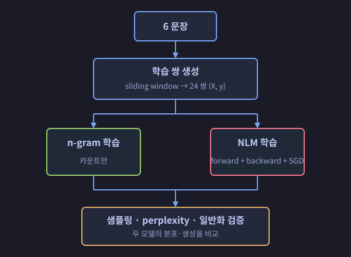
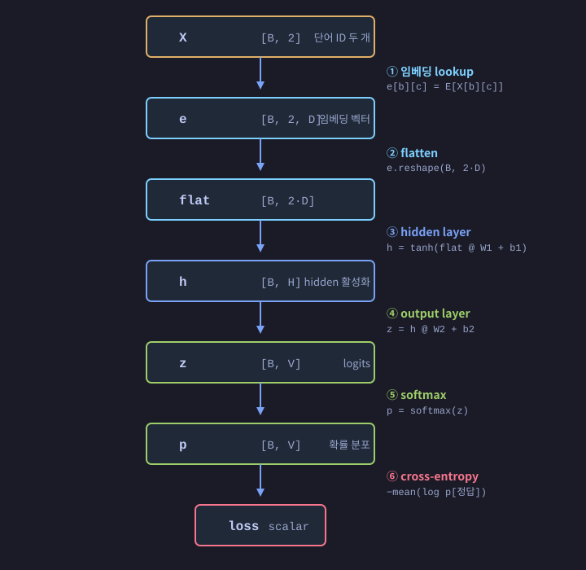

# 코드 가이드 — 처음 보는 사람을 위한 안내

이 가이드는 **코드의 큰 그림과 이론적 핵심**을 빠르게 잡는 게 목적이다. 자잘한 실험 설정과 결과 수치는 [report.md](report.md)에서 다룬다.

---

## 1. 한 줄 요약

> 같은 6개 한국어 문장으로 **n-gram 언어 모델**과 **신경망 언어 모델 (NLM)**을 각각 학습시켜, 두 패러다임이 같은 데이터에서 *근본적으로 다른 분포*를 학습한다는 사실을 8 + 1개의 실험으로 확인한다.

---

## 2. 큰 그림



같은 입력으로 두 모델을 만들고, *예측 분포·생성 다양성·일반화 능력*을 나란히 비교한다.

---

## 3. 두 모델의 본질적 차이

| | n-gram | NLM (Bengio 2003 단순 변형) |
|---|---|---|
| 학습 방법 | **카운트** | **gradient descent로 가중치 학습** |
| 단어 표현 | 그냥 ID | **D차원 벡터 (word embedding)** |
| 일반화 | 본 적 있는 조합만 | 임베딩 공간의 거리·방향으로 새 조합도 추론 |
| 매개변수 수 | (V², V) 카운트 표 | 작은 행렬 몇 개 (E, W1, W2, b1, b2) |

**핵심 질문:** *"학습에 한 번도 등장하지 않은 컨텍스트 `(철수는, 바나나를)` 다음에 `좋아해`가 올 확률을 모델은 얼마로 줄까?"*

- n-gram → "본 적 없으니 모름. 11개 단어 모두 똑같이 1/11 (~9%)."
- NLM → "철수는는 영희는와 비슷한 자리에 임베딩되어 있고(영희는는 바나나 다음 좋아해를 함), 바나나 다음엔 좋아해/싫어해가 나오니까 → **99.9% 좋아해**"

이 차이가 신경망 언어 모델의 존재 이유다 (Bengio 2003 논문의 핵심 메시지).

---

## 4. 데이터 ([python/data.py](python/data.py))

토큰은 공백으로 자른 단어 (한글 한 어절 = 한 토큰).

6 문장:
```
철수는 사과를 좋아해
철수는 딸기를 좋아해
영희는 사과를 좋아해
영희는 딸기를 좋아해
영희는 바나나를 좋아해
짱구는 바나나를 싫어해
```

**Vocab (11 단어)**: `<pad>`, `<bos>`, `<eos>`, 철수는, 사과를, 좋아해, 딸기를, 영희는, 바나나를, 짱구는, 싫어해

**학습 쌍 만들기**: 각 문장을 `<pad> <bos> w1 w2 w3 <eos>`로 감싸고 길이 2 sliding window:

```
'철수는 사과를 좋아해'  →
   (<pad>, <bos>) → 철수는
   (<bos>, 철수는) → 사과를
   (철수는, 사과를) → 좋아해
   (사과를, 좋아해) → <eos>
```

6 문장 × 4 쌍 = **24 학습 쌍**.

---

## 5. n-gram 모델 ([python/ngram.py](python/ngram.py))

### 이론

trigram (= 두 단어 보고 다음 단어 예측):

```
P(w₃ | w₁, w₂) = count(w₁, w₂, w₃) / count(w₁, w₂)
                  ─────────────────────────────────
                            (MLE)
```

학습 = **카운트만 세는 것**. gradient도 backprop도 없다.

### 핵심 코드

▶ **Python** ([python/ngram.py](python/ngram.py))
```python
# 학습: 카운트 누적
for ctx, w in pairs:
    counts[ctx][w] += 1
    totals[ctx]    += 1

# 추정: 단순 비율
prob[w] = counts[ctx][w] / totals[ctx]
```

▶ **C** ([c/ngram.c](c/ngram.c))
```c
/* 학습: 카운트 누적 */
for (int i = 0; i < n; i++) {
    int ci = ctx_idx(X[i][0], X[i][1]);   /* (a, b) → 단일 인덱스 */
    m->counts[ci][y[i]] += 1.0;
    m->totals[ci]       += 1.0;
}

/* 추정: 단순 비율 */
for (int v = 0; v < VOCAB_SIZE; v++)
    out[v] = m->counts[ci][v] / m->totals[ci];
```

같은 알고리듬 — Python의 dict는 C에선 `[a*V + b]` 평면화 인덱스로, fancy indexing은 명시적 for 루프로 바뀐다.

### 두 가지 약점과 대처

1. **Unseen context** — `(철수는, 바나나를)`은 학습에 없음. 분모 `count(철수는, 바나나를) = 0`이라 0/0.
   → 코드는 uniform fallback (1/V)으로 처리.

2. **Seen context, unseen 다음 단어** — 예: `(영희는, 사과를) → 싫어해`. count = 0이라 P=0.
   → **add-k smoothing**: 모든 카운트에 가상 k를 더해 `(count + k) / (total + k·V)`. k=0이 곧 MLE, k가 커지면 못 본 조합에 더 많은 확률을 떼어주는 trade-off.

[ngram.py](python/ngram.py)의 `prob()` 메서드 한 곳에 위 로직이 모두 모여 있다.

---

## 6. 신경망 언어 모델 ([python/nlm.py](python/nlm.py))

### 구조

Bengio 2003의 단순 변형 (direct connection 없는 형태):



기호: B=배치 크기, C=context length(=2), D=embedding 차원, H=hidden 뉴런 수, V=vocab 크기.

학습 가능한 가중치는 5개:

| 이름 | 모양 | 의미 |
|---|---|---|
| `E`  | [V, D] | **Word embedding 테이블.** 각 단어 ID에 D차원 벡터 |
| `W1` | [2D, H] | 첫 번째 layer 가중치 |
| `b1` | [H] | 첫 번째 layer bias |
| `W2` | [H, V] | 출력 layer 가중치 |
| `b2` | [V] | 출력 layer bias |

핵심은 `E` — 단어를 거리·방향이 의미를 갖는 공간 안의 점으로 만드는 학습 가능 lookup 테이블. 비슷한 문맥에서 등장한 단어는 비슷한 벡터를 갖게 된다 (이게 일반화의 원천).

### Forward — 한 함수에 여섯 줄

▶ **Python** ([python/nlm.py](python/nlm.py))
```python
e    = self.E[X]                           # ① lookup
flat = e.reshape(B, C * D)                 # ② 펼침
h    = np.tanh(flat @ self.W1 + self.b1)   # ③ hidden
z    = h @ self.W2 + self.b2               # ④ output
p    = softmax(z)                          # ⑤ 확률
loss = -np.log(p[정답]).mean()             # ⑥ NLL
```

▶ **C** ([c/nlm.c](c/nlm.c)) — 같은 6 단계, numpy 행렬 연산 대신 명시적 nested for 루프
```c
/* ① lookup + ② flatten */
for (int b = 0; b < B; b++)
    for (int c = 0; c < C; c++)
        for (int d = 0; d < D; d++)
            flat[b][c*D + d] = E[X[b][c]][d];

/* ③ h = tanh(flat @ W1 + b1) */
for (int b = 0; b < B; b++)
    for (int j = 0; j < H; j++) {
        double s = b1[j];
        for (int i = 0; i < C*D; i++) s += flat[b][i] * W1[i][j];
        h[b][j] = tanh(s);
    }

/* ④ z = h @ W2 + b2 */
for (int b = 0; b < B; b++)
    for (int v = 0; v < V; v++) {
        double s = b2[v];
        for (int j = 0; j < H; j++) s += h[b][j] * W2[j][v];
        z[b][v] = s;
    }

/* ⑤ softmax (행 단위) */
for (int b = 0; b < B; b++) {
    double mx = z[b][0];
    for (int v = 1; v < V; v++) if (z[b][v] > mx) mx = z[b][v];
    double sum = 0;
    for (int v = 0; v < V; v++) { p[b][v] = exp(z[b][v] - mx); sum += p[b][v]; }
    for (int v = 0; v < V; v++) p[b][v] /= sum;
}

/* ⑥ loss = -mean log p[b][y[b]] */
double loss = 0;
for (int b = 0; b < B; b++) loss -= log(p[b][y[b]]);
loss /= B;
```

### Backward — autograd 없이 손으로 미분

PyTorch의 `loss.backward()` 같은 자동 미분 엔진은 안 쓴다. 위 6줄 식 전체를 **종이에 미분 식을 풀어** 그 결과를 그대로 옮긴 것.

▶ **Python** ([python/nlm.py](python/nlm.py))
```python
# ⑦ ∂L/∂z   (softmax + cross-entropy 합성 미분)
dz = (p - one_hot(y)) / B

# ⑧ 출력층 W2, b2
gW2 = h.T @ dz
gb2 = dz.sum(axis=0)

# ⑨ hidden까지 거꾸로
dh     = dz @ W2.T
dh_pre = dh * (1 - h*h)        # tanh 미분: 1 - tanh²

# ⑩ 은닉층 W1, b1
gW1 = flat.T @ dh_pre
gb1 = dh_pre.sum(axis=0)

# ⑪⑫ 임베딩 테이블 (scatter-add)
dflat = dh_pre @ W1.T
gE[X[b,c]] += dflat[b, c·D : (c+1)·D]
```

▶ **C** ([c/nlm.c](c/nlm.c))
```c
/* ⑦ dz = (p - one_hot(y)) / B */
for (int b = 0; b < B; b++) {
    for (int v = 0; v < V; v++) dz[b][v] = p[b][v] / B;
    dz[b][y[b]] -= 1.0 / B;
}

/* ⑧ gW2 = h^T @ dz, gb2 = sum_b dz */
for (int j = 0; j < H; j++)
    for (int v = 0; v < V; v++) {
        double s = 0;
        for (int b = 0; b < B; b++) s += h[b][j] * dz[b][v];
        gW2[j][v] = s;
    }
for (int v = 0; v < V; v++) {
    double s = 0;
    for (int b = 0; b < B; b++) s += dz[b][v];
    gb2[v] = s;
}

/* ⑨ dh_pre = (dz @ W2^T) * (1 - h^2) */
for (int b = 0; b < B; b++)
    for (int j = 0; j < H; j++) {
        double dh = 0;
        for (int v = 0; v < V; v++) dh += dz[b][v] * W2[j][v];
        dh_pre[b][j] = dh * (1.0 - h[b][j]*h[b][j]);
    }

/* ⑩ gW1 = flat^T @ dh_pre, gb1 = sum_b dh_pre */
for (int i = 0; i < C*D; i++)
    for (int j = 0; j < H; j++) {
        double s = 0;
        for (int b = 0; b < B; b++) s += flat[b][i] * dh_pre[b][j];
        gW1[i][j] = s;
    }
for (int j = 0; j < H; j++) {
    double s = 0;
    for (int b = 0; b < B; b++) s += dh_pre[b][j];
    gb1[j] = s;
}

/* ⑪ dflat = dh_pre @ W1^T */
for (int b = 0; b < B; b++)
    for (int i = 0; i < C*D; i++) {
        double s = 0;
        for (int j = 0; j < H; j++) s += dh_pre[b][j] * W1[i][j];
        dflat[b][i] = s;
    }

/* ⑫ gE: scatter-add */
for (int b = 0; b < B; b++)
    for (int c = 0; c < C; c++) {
        int id = X[b][c];
        for (int d = 0; d < D; d++) gE[id][d] += dflat[b][c*D + d];
    }
```

각 줄(또는 nested for 묶음) = 한 미분 식. 한 함수(`loss_and_grad`)에 forward와 backward가 위에서 아래로 흐르므로 *책처럼 읽으면* 끝.

### 학습 루프

▶ **Python** ([python/nlm.py](python/nlm.py))
```python
for epoch in range(EPOCHS):
    loss, grads = model.loss_and_grad(X, y)
    for param in [E, W1, b1, W2, b2]:
        param -= lr * grads[param]      # SGD
```

▶ **C** ([c/main.c](c/main.c))
```c
nlm_grad_t grad;
for (int ep = 0; ep < EPOCHS; ep++) {
    double loss = nlm_loss_and_grad(&nlm, &grad, X, y);
    nlm_sgd_step(&nlm, &grad, LR);
}
```

가장 단순한 SGD. 매 epoch마다 forward 한 번 + backward 한 번 + 한 step 업데이트.

---

## 7. C 구현 빌드와 실행 ([c/](c/))

위에서 보인 C 코드는 모두 [c/nlm.c](c/nlm.c)에 한 함수(`nlm_loss_and_grad`)로 모여 있다. 모델 사이즈는 [c/data.h](c/data.h)에 `#define`으로 박혀 있어 다차원 배열(`m->W1[i][j]`, `flat[b][i]` 등)을 자연스러운 행렬 표기로 사용한다.

빌드: [c/build.bat](c/build.bat)이 vswhere로 VS2022 cl.exe를 자동 탐색해 두 binary를 만든다.

```cmd
c\build.bat
c\build\minimal_example_h8.exe   :: HIDDEN=8 (기본)
c\build\minimal_example_h6.exe   :: HIDDEN=6  (build.bat에서 /DHIDDEN=6 으로 빌드)
```

`matmul` 같은 일반 행렬 연산 헬퍼는 일부러 안 쓴다 — 각 식을 그 자리에서 풀어 두면 어떤 인덱스가 무엇과 곱해지는지 한눈에 보이고, Python의 [nlm.py](python/nlm.py)와 줄 단위로 대응한다.

---

## 8. 파일 구조

```
minimal_example/
├── PLAN.md           구현 계획·명세
├── report.md         실험 결과 리포트
├── GUIDE.md          (이 문서)
│
├── python/
│   ├── data.py       6 문장 → vocab → 학습 쌍
│   ├── ngram.py      n-gram 모델 (카운트 + smoothing)
│   ├── nlm.py        NLM (forward + 직접 미분 backward)
│   └── utils.py      공용 헬퍼 (UTF-8, 한글 폰트, seed)
│
├── c/
│   ├── data.[ch]     같은 데이터, 정수 배열
│   ├── rng.[ch]      splitmix64 PRNG
│   ├── ngram.[ch]    Python ngram의 C 버전
│   ├── nlm.[ch]      Python nlm의 C 버전 (직접 미분)
│   ├── main.c        n-gram + NLM 일괄 데모
│   └── build.bat     VS2022 자동 탐색 빌드
│
├── experiments/
│   ├── exp1 ~ exp9   각 실험 (자세한 내용은 report.md)
│   └── exp_common.py 실험 공용 헬퍼
│
└── results/          그래프 (.png), 표 (.tsv), 애니메이션 (.mp4), 로그
```

---

## 9. 추천 읽기 순서

1. **이 문서** — 큰 그림 잡기
2. [python/data.py](python/data.py) — 데이터가 어떻게 만들어지는지 (10분)
3. [python/ngram.py](python/ngram.py) — n-gram의 단순함을 먼저 (10분)
4. [python/nlm.py](python/nlm.py) — `loss_and_grad` 함수 한 곳만 천천히 (30분)
   - forward 6단계와 backward 6단계가 어떻게 대응되는지 손으로 따라 미분해 보기
5. [c/nlm.c](c/nlm.c) — Python과 같은 단계 번호로 비교 (15분)
6. [report.md](report.md) — 실험 결과와 정량적 분석

[experiments/](experiments/) 안의 각 스크립트는 위 모델들을 호출만 하는 얇은 래퍼라, 모델 자체를 이해하면 실험 코드는 빠르게 읽힌다.

---

## 10. 한 가지 핵심 메시지

이 프로젝트의 모든 코드와 실험이 향하는 결론은 단 하나:

> **n-gram이 "본 것을 그대로 외우는" 모델이라면, 신경망 언어 모델은 "본 것에서 패턴을 추출해 본 적 없는 것까지 추론하는" 모델이다.** 임베딩 공간이 이 추론을 가능케 하는 매개체이며, 단어를 distributed vector로 표현하는 단순한 아이디어가 그것을 만들어 낸다.
