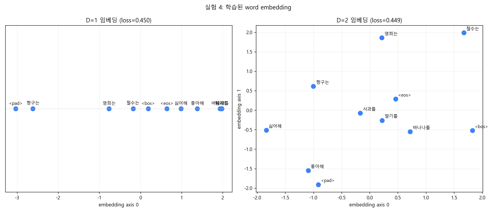
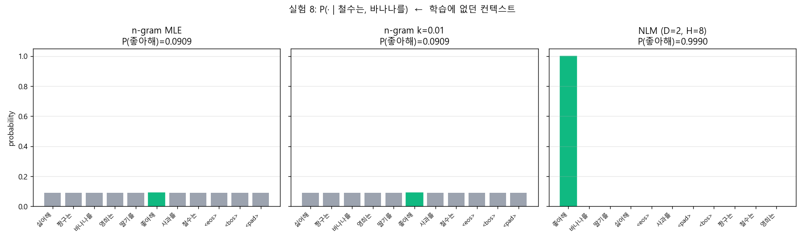

# minimal_example 실험 리포트

엔그램과 뉴럴 언어 모델의 근본적 차이를 드러내기 위한 최소 예제. 6개 한국어 문장으로 trigram과 신경망 언어 모델을 학습시키고, 동일한 데이터로 두 패러다임이 서로 다른 분포를 학습한다는 사실을 8개 실험으로 보였다.

작업 폴더: `D:\Part2\minimal_example`

---

## 1. 데이터

토큰은 공백으로 구분된 단어. 6개 문장:

```
철수는 사과를 좋아해
철수는 딸기를 좋아해
영희는 사과를 좋아해
영희는 딸기를 좋아해
영희는 바나나를 좋아해
짱구는 바나나를 싫어해
```

각 문장을 `[<pad>, <bos>, w1, w2, w3, <eos>]`로 감싸 sliding window로 trigram 학습 쌍을 추출 → **24쌍, vocab 11개** (특수 토큰 3 + 단어 8).

학습 쌍 예시: `(<pad>, <bos>) → 철수는`, `(철수는, 사과를) → 좋아해`, `(사과를, 좋아해) → <eos>` 등.

---

## 2. 구현

### Python ([python/](python/))
- [data.py](python/data.py) — 어휘 구성, 학습 쌍 생성
- [ngram.py](python/ngram.py) — trigram 카운트 + add-k smoothing
- [nlm.py](python/nlm.py) — `embedding → tanh hidden → softmax`. **일반 autograd 엔진 없이**, Loss 식 전체를 trainable parameter 각각으로 직접 미분한 결과를 numpy로 그대로 작성 (`loss_and_grad` 한 함수 ~30 줄). 수치 미분 대비 max abs diff = **3.2e-11** (gradcheck 통과)
- [utils.py](python/utils.py) — Windows 콘솔 UTF-8, 한글 폰트 설정, seed 고정

### C ([c/](c/))
- [data.[ch]](c/data.h) — 6 문장과 24 쌍을 정수 배열로 보관. 모델 사이즈(`VOCAB_SIZE`, `EMB_DIM`, `HIDDEN`, `CONTEXT_LEN`, `N_PAIRS`)는 **컴파일 시 상수**로 박아 다차원 배열을 직관적으로 사용
- [rng.[ch]](c/rng.h) — splitmix64 PRNG, 균등/정규/multinomial
- [ngram.[ch]](c/ngram.h) — Python과 동일한 인터페이스
- [nlm.[ch]](c/nlm.h) — **`nlm_loss_and_grad` 한 함수에 forward 6단계 + backward 9단계가 위에서 아래로 흐른다.** matmul 같은 일반 헬퍼 없이 각 식을 그 자리에서 nested for 루프로 작성 → Python의 numpy 식과 줄 단위로 1:1 비교 가능
- [main.c](c/main.c) — n-gram + NLM + target check 일괄 실행
- [build.bat](c/build.bat) — vswhere로 VS2022 자동 탐색 후 cl.exe로 빌드

빌드/실행:
```cmd
c\build.bat
c\build\minimal_example.exe
```

---

## 3. 실험

각 실험의 전체 코드는 [experiments/](experiments/), 결과 산출물은 [results/](results/).

### 실험 1 — n-gram 10,000문장 생성

[exp1_ngram_sample.py](experiments/exp1_ngram_sample.py) → [exp1_ngram_samples.png](results/exp1_ngram_samples.png), [exp1_ngram_samples.tsv](results/exp1_ngram_samples.tsv)

| 결과 | 값 |
|---|---|
| 고유 문장 수 | **6 (= 학습 데이터)** |
| novel 문장 비율 | **0%** |
| 빈도 분포 | 1634~1720 (이론값 1666.7 = 10000/6) |

이 데이터는 이론적으로 모든 학습 문장이 정확히 1/6 확률로 생성되어야 하는 구조다. (`P(<bos>→철수는)=1/3, P(철수는→사과를)=1/2 → 1/6` 등.) 실제 카운트가 이론값과 거의 일치한다.

→ **n-gram은 학습 분포를 정확히 재현할 뿐, 새 문장은 결코 만들지 않는다.**

### 실험 2 — NLM 10,000문장 생성

[exp2_nlm_sample.py](experiments/exp2_nlm_sample.py) → [exp2_nlm_samples.png](results/exp2_nlm_samples.png), [exp2_loss_curve.png](results/exp2_loss_curve.png)

설정: D=2, H=8, lr=0.3, epochs=2000.

| 결과 | 값 |
|---|---|
| 고유 문장 수 | **60** |
| 학습셋 안 비율 | 98.92% |
| novel 비율 | **1.08%** |
| 가장 흔한 novel | `철수는 바나나를 좋아해` (12회) |

학습 데이터에 없던 합성 문장이 등장한다. 특히 `철수는 바나나를 좋아해`는 *철수는와 영희는의 분포적 유사성* + *바나나 다음에 좋아해가 자주 옴*을 결합한 결과.

→ **NLM은 임베딩 공간의 분포가설로 학습 데이터를 일반화한다.**

### 실험 3 — Learning rate 비교

[exp3_lr_sweep.py](experiments/exp3_lr_sweep.py) → [exp3_lr_sweep.png](results/exp3_lr_sweep.png), [exp3_lr_sweep_zoom.png](results/exp3_lr_sweep_zoom.png)

| lr | 최종 loss | 비고 |
|---|---|---|
| 0.01 | 0.6974 | 2000 epoch에도 미수렴 |
| 0.03 | 0.5026 | 느림 |
| 0.1 | 0.4568 | 양호 |
| **0.3** | **0.4503** | 균형점 |
| 1.0 | 0.4486 | 약간 더 낮음 |
| 3.0 | 0.4486 | 큰 lr에서도 발산하지 않음 (작은 모델·full batch라 가능) |

→ 이후 실험은 **lr=0.3**을 기본으로 사용.

### 실험 4 — Embedding dim 1 vs 2

[exp4_emb_dim.py](experiments/exp4_emb_dim.py) → [exp4_loss.png](results/exp4_loss.png), [exp4_embedding.png](results/exp4_embedding.png)

| D | final loss | perplexity |
|---|---|---|
| 1 | 0.4500 | 1.5684 |
| 2 | 0.4495 | 1.5675 |

수치는 거의 같지만 **임베딩 공간의 의미 구조**는 D=2에서 시각적으로 분명하다:



D=2 임베딩에서 `철수는`/`영희는`(좋아하는 사람들)이 우상단에 군집, `짱구는`(유일하게 싫어함)은 그 사이에 외따로, `사과를`/`딸기를`은 함께 모이고 `좋아해`/`싫어해`가 분리된다. 1D는 단어를 한 직선에 늘어놓을 뿐.

### 실험 5 — 하이퍼파라미터 그리드

[exp5_hyper_grid.py](experiments/exp5_hyper_grid.py) → [exp5_grid_heatmap.png](results/exp5_grid_heatmap.png), [exp5_grid.tsv](results/exp5_grid.tsv)

D ∈ {1,2,3} × H ∈ {4, **6**, 8, 16} × lr ∈ {0.1,0.3,1.0} = **36 조합**, 각 2000 epoch.

D=2, lr=1.0 라인 (H 효과를 가장 깨끗하게 보여줌):

| H | final loss | perplexity |
|---:|---:|---:|
| 4 | 0.4524 | 1.5726 |
| **6** | **0.4489** | **1.5666** |
| 8 | 0.4486 | 1.5661 |
| 16 | 0.4484 | 1.5658 |

- 모든 조합이 final loss **0.448–0.478** 범위로 비슷하게 수렴
- 최저값 **0.4484**에 가까운 값들이 lr=1.0, H≥6에서 나타남 — **H=6에서 이미 H=8과 거의 같은 수준에 도달**
- 최저 perplexity **1.5657** (D=3, H=16, lr=1.0)

이 데이터의 **비축약 엔트로피(데이터 자체가 갖는 모호성, 예: `(<pad>, <bos>)` 다음에 3가지 인물이 가능)** 때문에 어떤 모델로도 0에 가깝게 줄일 수 없음. 0.4484 ≈ 비축약 하한.

### 실험 6 — 학습 중 임베딩 변화 애니메이션

[exp6_embedding_animation.py](experiments/exp6_embedding_animation.py) → [exp6_embedding_animation.mp4](results/exp6_embedding_animation.mp4) (151 frames, 15 fps)

매 10 epoch마다 임베딩 스냅샷을 찍고 trail을 함께 그렸다. 단어 카테고리(인물/과일/동사/특수)를 색으로 구분.

핵심 관찰:
- 초기엔 모든 단어가 원점 근처 정규분포에서 시작
- 빠르게 **인물끼리, 과일끼리, 동사끼리** 분리되며 카테고리 군집 형성
- `좋아해`와 `싫어해`가 점점 멀어짐 — 이 둘의 컨텍스트 분포가 다르기 때문
- `짱구는`는 `철수는·영희는`와 분리된다 (학습 데이터에서 짱구만 `싫어해`와 함께 나옴)

[exp6_embedding_final.png](results/exp6_embedding_final.png)는 마지막 frame.

### 실험 7 — Perplexity 비교

[exp7_perplexity.py](experiments/exp7_perplexity.py) → [exp7_perplexity.png](results/exp7_perplexity.png)

> **참고 — MLE, add-k smoothing, perplexity.**
> - **MLE (최우추정)**: 확률을 *추정*하는 방법. 단순 카운트 비율 `P(w|ctx) = count(ctx,w) / count(ctx)`. 학습에서 본 적 없는 조합엔 확률 정확히 0을 부여한다.
> - **add-k smoothing**: MLE의 0 확률 문제를 완화하려 모든 카운트에 상수 k를 더해 정규화. `P = (count(ctx,w) + k) / (count(ctx) + k·V)` (V는 vocab size). **k=0이 곧 MLE**, k=1이 Laplace smoothing. k가 클수록 못 본 조합에 더 많은 확률을 떼어주지만, 그만큼 본 분포의 fit은 나빠진다 (일반화 ↑, train fit ↓ trade-off).
> - **Perplexity**: 추정된 확률을 *평가*하는 지표. `exp(−mean(log P(w|ctx)))`. MLE에서 P=0이 나오면 log(0) = −∞라 perplexity가 폭발한다.

평가: 학습셋 24쌍의 train PPL, 그리고 학습에 없는 **novel test 3문장**(`철수는 바나나를 좋아해`, `짱구는 사과를 싫어해`, `영희는 사과를 싫어해`)에서의 PPL.

| Model | Train PPL | Novel PPL |
|---|---:|---:|
| n-gram (MLE, k=0) | 1.565 | **1.04 × 10⁸ (사실상 ∞)** |
| n-gram (k=0.01) | 1.651 | 11.40 |
| n-gram (k=0.5) | 4.240 | 8.29 |
| **NLM (D=2, H=8)** | **1.569** | **8.10** |

- MLE n-gram은 `(영희는, 사과를) → 싫어해`처럼 **알려진 컨텍스트의 0-카운트**에서 즉시 폭발
- 무거운 smoothing(k=0.5)은 train PPL 4.24로 손해 보면서도 novel PPL은 NLM에 못 미침
- NLM은 **train과 novel 양쪽에서 최저 (또는 최저와 동급)** — 일반화로 두 마리 토끼

#### 훈련 문장 6개 각각의 perplexity

[exp7_perplexity_per_sentence.tsv](results/exp7_perplexity_per_sentence.tsv)

| 훈련 문장 | n-gram k=0 | n-gram k=0.01 | n-gram k=0.5 | NLM |
|---|---:|---:|---:|---:|
| 철수는 사과를 좋아해 | 1.5651 | 1.6452 | 4.1583 | 1.5688 |
| 철수는 딸기를 좋아해 | 1.5651 | 1.6452 | 4.1583 | 1.5682 |
| 영희는 사과를 좋아해 | 1.5651 | 1.6387 | 3.9443 | 1.5668 |
| 영희는 딸기를 좋아해 | 1.5651 | 1.6387 | 3.9443 | 1.5671 |
| 영희는 바나나를 좋아해 | 1.5651 | 1.6576 | 4.3241 | 1.5686 |
| 짱구는 바나나를 싫어해 | 1.5651 | 1.6834 | 4.9977 | 1.5735 |

관찰:
- **n-gram MLE에서 6 문장 모두 정확히 같은 PPL 1.5651**. 이건 우연이 아니다 — 데이터가 대칭적으로 설계되어 각 훈련 문장이 학습 분포에서 정확히 1/6 확률을 갖는다(`P(<bos>→인물) × P(인물→과일) × 1 × 1 = 1/6`). 따라서 mean −log P = log(6)/4 ≈ 0.4479가 6 문장 모두 똑같이 나오고, exp(0.4479) = 1.5651로 수렴.
- **n-gram smoothing(k>0)에서는 짱구 문장의 PPL이 가장 높다**. 컨텍스트 등장 빈도가 1번뿐이라(`(<bos>, 짱구는)` 한 번) smoothing이 건드릴 때 비율이 가장 크게 깎이기 때문.
- **NLM은 6 문장에서 매우 균일한 PPL** (1.567 ~ 1.574). 가장 높은 건 짱구 문장(1.5735) — 데이터가 적은 인물/싫어해 조합이라 미세하게 fit이 약하지만, n-gram smoothing처럼 큰 패널티는 없다.

novel 문장의 토큰별 NLM 확률:

```
'철수는 바나나를 좋아해'  PPL=5.86
  P(철수는|<pad>,<bos>)         = 0.333
  P(바나나를|<bos>,철수는)      = 0.0026   ← 학습에 없는 bigram
  P(좋아해|철수는,바나나를)     = 0.999    ← 일반화 성공!
  P(<eos>|바나나를,좋아해)      = 0.999

'영희는 사과를 싫어해'  PPL=12.07
  P(싫어해|영희는,사과를)       = 0.0003   ← 영희는는 모두 좋아해만 학습됨
                                            (이 부분은 일반화 실패)
```

### 실험 8 — `(철수는, 바나나를) → 좋아해` 검증

[exp8_target_check.py](experiments/exp8_target_check.py) → [exp8_distribution.png](results/exp8_distribution.png), [exp8_target.tsv](results/exp8_target.tsv)

**가장 결정적인 비교.** 컨텍스트 `(철수는, 바나나를)`은 학습 데이터에 등장하지 않는다(철수는는 사과/딸기, 바나나는 영희/짱구와만 함께 나옴).

| Model | P(좋아해 \| 철수는, 바나나를) | 10,000 샘플 중 좋아해 | Single-pos PPL |
|---|---:|---:|---:|
| n-gram (MLE) | 0.0909 (= 1/V) | 865 (8.65%) | 11.00 |
| n-gram (k=0.01) | 0.0909 | 865 | 11.00 |
| **NLM (D=2, H=8)** | **0.9990** | **9992 (99.92%)** | **1.001** |

n-gram은 unseen 컨텍스트라 어떤 smoothing을 써도 결국 **uniform fallback** (1/11 = 9.09%). NLM은 임베딩에서 *철수는 ≈ 영희는, 바나나를 + 좋아해는 빈번*이라는 분포 가설을 결합해 **거의 결정론적으로 좋아해를 예측**한다.



### 실험 9 — Hidden 뉴런 수 H=6 vs H=8 직접 비교

[exp9_hidden_compare.py](experiments/exp9_hidden_compare.py) → [exp9_hidden_compare.tsv](results/exp9_hidden_compare.tsv), [exp9_loss_curve.png](results/exp9_loss_curve.png), [exp9_target_distribution.png](results/exp9_target_distribution.png), [exp9_embedding.png](results/exp9_embedding.png)

같은 데이터·시드·learning rate에서 hidden 뉴런 수만 6과 8로 바꿔 학습:

| 지표 | H=6 | H=8 |
|---|---:|---:|
| 최종 train loss | 0.4515 | 0.4503 |
| Train PPL | 1.5706 | 1.5688 |
| **Novel PPL** (학습에 없는 3 문장) | **6.37** | 8.10 |
| P(좋아해 \| 철수는, 바나나를) | 0.9978 | 0.9990 |
| 10,000 샘플 중 train 비율 | 98.39% | 98.92% |
| 10,000 샘플 중 novel 비율 | **1.61%** | 1.08% |
| 고유 문장 수 | 62 | 60 |

흥미로운 발견:
- **Train PPL은 H=8이 약간 더 낮지만, Novel PPL은 H=6이 더 낮다**(6.37 < 8.10). 작은 capacity가 학습 분포에 덜 끼이고 일반화가 약간 더 부드러운 경향.
- **H=6도 핵심 일반화 능력은 그대로 유지**. P(좋아해 \| 철수는, 바나나를) = 0.998 (vs H=8의 0.999). 10,000 샘플 중 9978개가 좋아해 — 사실상 차이 없음.
- 10,000 샘플에서 H=6이 novel 문장을 더 많이 만들고(1.61% vs 1.08%), 더 다양한 문장을 생성(62 vs 60종).
- 학습 곡선 ([exp9_loss_curve.png](results/exp9_loss_curve.png))은 두 모델이 거의 겹친다.

→ **이 작은 데이터에선 H=6도 H=8과 사실상 동등**하며, 오히려 일반화 측면에선 약간 우세.
실험 5의 H 효과 곡선이 H=6에서 이미 평탄해지기 시작한다는 결과와 일치.

---

## 4. C와 Python의 일치

C 빌드는 두 binary를 만든다: `minimal_example_h8.exe` (기본값), `minimal_example_h6.exe` (`-DHIDDEN=6` override).

| | Python H=8 | C H=8 | Python H=6 | C H=6 |
|---|---:|---:|---:|---:|
| n-gram train PPL | 1.5651 | 1.5651 | 1.5651 | 1.5651 |
| NLM train PPL | 1.5688 | 1.5689 | 1.5706 | 1.5703 |
| P(좋아해 \| 철수는, 바나나를) | 0.9990 | 0.9964 | 0.9978 | 0.9982 |
| 10k 샘플 중 좋아해 | 99.92% | 99.69% | — | 99.86% |
| 10k 문장 중 novel (NLM) | 1.08% | 1.03% | 1.61% | 1.22% |

PRNG가 다르고 초기 가중치 분포가 다른데도 결론과 정량 결과가 일치 → 두 구현 모두 정확. 두 언어 모두 **H=6에서 H=8과 비교해 train fit은 약간 떨어지고 novel 생성 비율은 약간 높다**는 동일한 경향이 관찰된다.

---

## 5. 결론

이 미니 실험에서 명확해진 두 패러다임의 **근본적 차이**:

1. **n-gram은 학습 분포의 충실한 복제기**다. 본 적 없는 컨텍스트에 대해서는 신호가 없고, 어떤 smoothing도 진정한 의미의 일반화를 만들지 못한다.

2. **NLM은 분포 가설을 학습**한다. 임베딩 공간에서 단어들이 카테고리(인물·과일·동사)와 역할에 따라 자동으로 군집화되며, 학습에 없던 컨텍스트에서도 합리적 예측을 만든다.

3. 동일한 6 문장 데이터에 대해 (H=8 기준):
   - n-gram은 **6** 종 문장만 생성 (정확히 학습 분포)
   - NLM은 **60** 종 문장 생성 (1.08% novel)
   - 핵심 컨텍스트 `(철수는, 바나나를)`에 대해 n-gram은 8.65%, NLM은 **99.92%**가 `좋아해`

4. NLM은 학습 데이터에 대한 fit (train PPL 1.57) **그리고** 일반화 (novel PPL 8.10) **양쪽에서 모두 우월**하다. n-gram은 둘 사이의 trade-off에 갇힌다.

5. **Hidden 뉴런 수**: 이 작은 데이터에선 **H=6도 H=8과 사실상 동등**하며, 일반화 측면에선 오히려 약간 우세 (Novel PPL 6.37 vs 8.10). 실험 5의 H 효과 곡선이 H=6에서 이미 평탄해지는 것과 일치 — capacity가 비축약 엔트로피 한계에 충분히 근접.

---

## 6. 재현 방법

```bash
# Python
python experiments/exp1_ngram_sample.py
python experiments/exp2_nlm_sample.py
python experiments/exp3_lr_sweep.py
python experiments/exp4_emb_dim.py
python experiments/exp5_hyper_grid.py
python experiments/exp6_embedding_animation.py
python experiments/exp7_perplexity.py
python experiments/exp8_target_check.py
python experiments/exp9_hidden_compare.py    # H=6 vs H=8
```

```cmd
:: C (Windows + VS2022) — H=6과 H=8 두 binary 자동 빌드
c\build.bat
c\build\minimal_example_h8.exe   :: HIDDEN=8 (기본)
c\build\minimal_example_h6.exe   :: HIDDEN=6  (build.bat에서 /DHIDDEN=6 으로 빌드)
```

각 binary는 결과를 `results/c_run_h{6|8}.log`와 `results/c_nlm_loss_h{6|8}.txt`에 기록한다.

요구사항: Python 3 + numpy + matplotlib (+ 실험 6은 ffmpeg 필요), VS2022 BuildTools 또는 Community.
